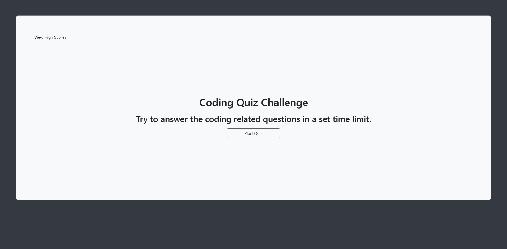
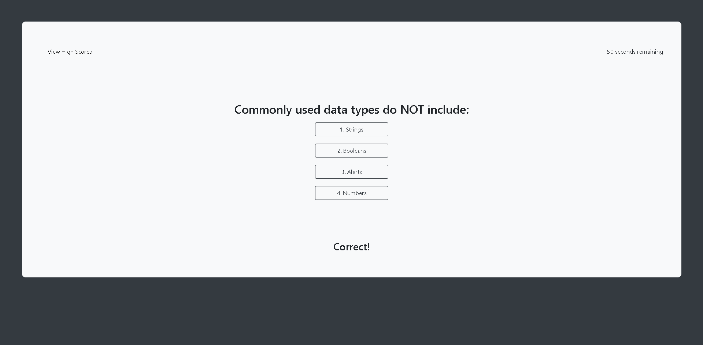
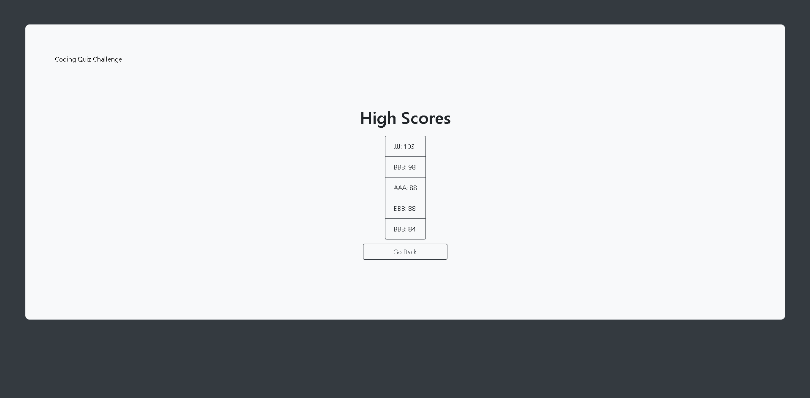

# coding-quiz

# Purpose
This is a quiz to test your knowledge on basic JavaScript. Once the user selects the 'Start Quiz' button, the first question of a timed quiz will display. Answer a question wrong, and time will be deducted from the timer. Once the questions have been answered or the timer runs out, the user can submit their score with their initials and see how they rank against other players! The code base uses HTML, CSS, JavaScript, and Bootstrap.

# Repo and Live Page
* [GitHub Repo](https://github.com/dolcebasstrombone/coding-quiz)
* [Live Page](https://dolcebasstrombone.github.io/coding-quiz/)

## Screenshots

